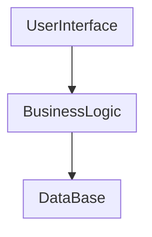

# HBnB Project

## Introduction
The HBNB project is a mini-version of the Airbnb website.
The user can set some informations about the place, users, review and amenity.
This document constitutes the complete technical information for this project.
It brings together all the UML diagrams produced to illustrate the application architecture, the business logic and the communication flows between layers. 
The goal is to provide a clear, readable and structured explanation of our project.


## Package Diagram 
In this diagramm, the purpose is to show how the global architecture of the application work. It illustrates how to application is modularly divided into three keys logical layers. 
This diagram helps developers quickly understand the structure and responsibility of each major part of the application without diving into the implementation details.



    
## Class Diagram 

This diagram describe the interaction with the différent Logic component.
First the place have some amenity, a amenity cannot exist without place. 
A place is located by a user, this user can make a review about the quality of service. 
AMENITY, USER, PLACE AND REVIEW are the entity use by the website via the BusinessLogicLayer
Relation between place and review. 
1 place can have many review
1 Review is written by one user and one place
1 user can create many review

```mermaid
## Class Diagram 

* This diagram discribe the business logic layer and interaction with the different Logic component.
  
* This diagram represent 4 Class :
  - Place where the user can live for a night or more
  - The amenity of the place Wifi, Number of pieces, Number of piece
  - The user connect to the website and if the user is an admin with more power of moderate the website
  - The review with the notation of a place by a user and comments about the place
  - AMENITY, USER, PLACE AND REVIEW are the entity use by the website via the BusinessLogicLayer

* Each class have field like date creation, date modification and a uniq id needed by the Database to identify the place, the review, the amenity or the user.

* This class diagram provide data and function usefull for the interaction between the facade patern and the database
* You can create, update, delete a REVIEW
* You can create, update, delete a PLACE
* You can create, update, delete a AMENITY
* You can create, update, delete a USER

* Interaction between class : 
  - First the place have some amenity, a amenity cannot exist without place. 
  - A place is located by a user, this user can make a review about the quality of service. 
  - Relation between place and review : 
  - 1 place can have many review
  - 1 Review is written by one user and one place
  - 1 user can create many review

```mermaid
classDiagram
direction TB
namespace BusinessLogicLayer {


    class AmenityEntity {
+int idAmenity
    +String name
    +String description
    +int idPlace
    +Date dateCreation
    +Date dateModification
    +createAmenity()
    +updateAmenity()
    +deleteAmenity()
    }

    class ReviewEntity {
    +Float rating
    +String comment
    +Date dateCreation
    +Date dateModification
    +int idPlace
    +int idUser
    +listReviewByPlace(idPlace) List Review
    +listReviewByUser(idUser) List Review
+createReview()
    +updateReview()
    +deleteReview()
    }

    class UserEntity {
    +int idUser
    +String firstName
    +String lastName
    +String email
    +String password
    +bool isAdmin
    +Date dateCreation
    +Date dateModification
    +isAdmin()
    +createUser()
    +updateUser()
    +deleteUser()
+listUser()
+listAdmin()
    }

    class PlaceEntity {
    +int idPlace
    +String title
    +String description
    +Float price
    +Float latitude
    +Float longitude
    +Date dateCreation
    +Date dateModification
    +createPlace()
    +updatePlace()
    +deletePlace()
+listPlace()
+listAmenity(idPlace) List:Amenity
    }
}
    PlaceEntity *-- AmenityEntity
    PlaceEntity "1" -- "*" ReviewEntity
    ReviewEntity "*" -- "1" UserEntity


```
