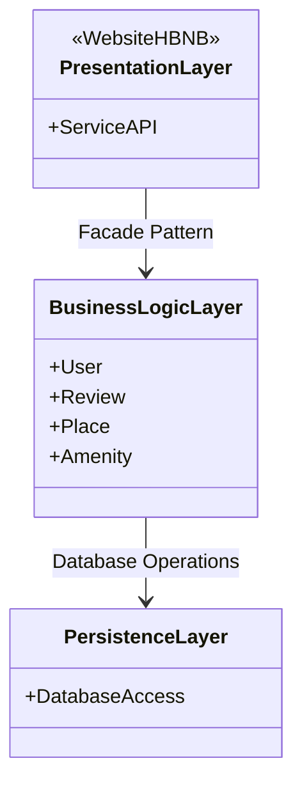

# holbertonschool-hbnb
<<<<<<< HEAD
Technical documentation of mini version of Hbnb

## Introduction
The HBNB project is a website to rent place between users.
The user can set some informations about the place, users, review and amenity.
In this document you will see the diagram use for the project.

## Package Diagram 




## Class Diagram 

This diagram describe the interaction with the différent Logic component.
First the place have some amenity, a amenity cannot exist without place. 
A place is located by a user, this user can make a review about the quality of service. 
AMENITY, USER, PLACE AND REVIEW are the entity use by the website via the BusinessLogicLayer
Relation between place and review. 
1 place can have many review
1 Review is written by one user and one place
1 user can create many review

=======
Technical documentation of mini version of Airbnb

## Class Diagram 
>>>>>>> 6b1d323 (fix: moved all files to the directory part1)
```mermaid
classDiagram
direction TB
	namespace BusinessLogicLayer {

	
    class AmenityEntity {
		+int idAmenity
	    +String name
	    +String description
	    +int idPlace
	    +Date dateCreation
	    +Date dateModification
	    +createAmenity()
	    +updateAmenity()
	    +deleteAmenity()
    }

    class ReviewEntity {
<<<<<<< HEAD
<<<<<<< HEAD
	    +Float rating
=======
	    +double rating
>>>>>>> 6b1d323 (fix: moved all files to the directory part1)
=======
	    +Float rating
>>>>>>> 37e7963 (Update Readme Double become float)
	    +String comment
	    +Date dateCreation
	    +Date dateModification
	    +int idPlace
	    +int idUser
	    +listReviewByPlace(idPlace) List Review
	    +listReviewByUser(idUser) List Review
		+createReview()
	    +updateReview()
	    +deleteReview()
    }

    class UserEntity {
	    +int idUser
	    +String firstName
	    +String lastName
	    +String email
	    +String password
	    +bool isAdmin
	    +Date dateCreation
	    +Date dateModification
	    +isAdmin()
	    +createUser()
	    +updateUser()
	    +deleteUser()
		+listUser()
<<<<<<< HEAD
<<<<<<< HEAD
		+listAdmin()
=======
		+listAdmn()
>>>>>>> 6b1d323 (fix: moved all files to the directory part1)
=======
		+listAdmin()
>>>>>>> fe36ca4 (remove typo listadmin)
    }

    class PlaceEntity {
	    +int idPlace
	    +String title
	    +String description
<<<<<<< HEAD
<<<<<<< HEAD
	    +Float price
	    +Float latitude
	    +Float longitude
=======
	    +Double price
	    +Double latitude
	    +Double longitude
>>>>>>> 6b1d323 (fix: moved all files to the directory part1)
=======
	    +Float price
	    +Float latitude
	    +Float longitude
>>>>>>> 37e7963 (Update Readme Double become float)
	    +Date dateCreation
	    +Date dateModification
	    +createPlace()
	    +updatePlace()
	    +deletePlace()
		+listPlace()
		+listAmenity(idPlace) List:Amenity
    }
}
    PlaceEntity *-- AmenityEntity
    PlaceEntity "1" -- "*" ReviewEntity
    ReviewEntity "*" -- "1" UserEntity


<<<<<<< HEAD
<<<<<<< HEAD
```
=======
```
>>>>>>> 6b1d323 (fix: moved all files to the directory part1)
=======
```
>>>>>>> fe36ca4 (remove typo listadmin)
