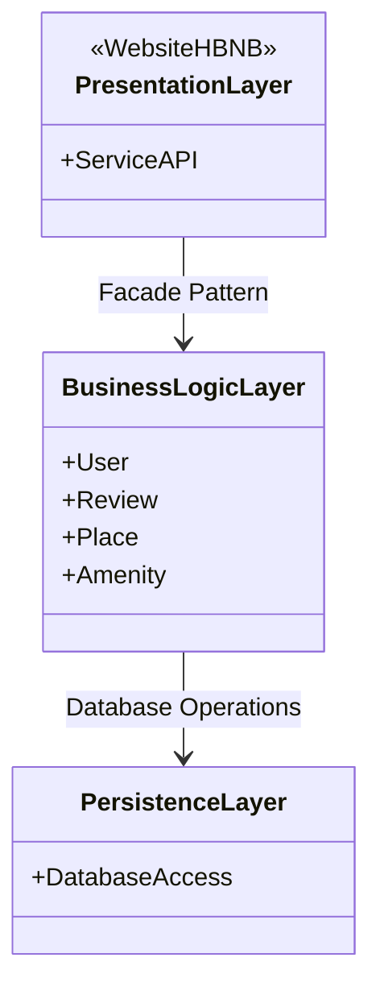
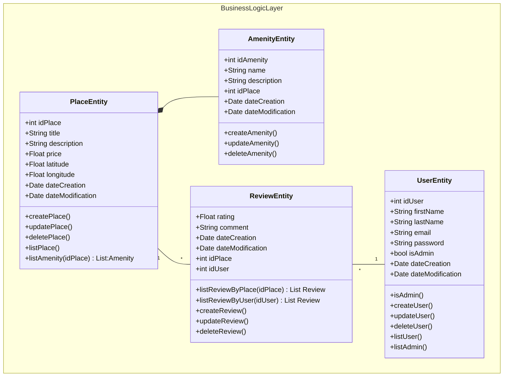
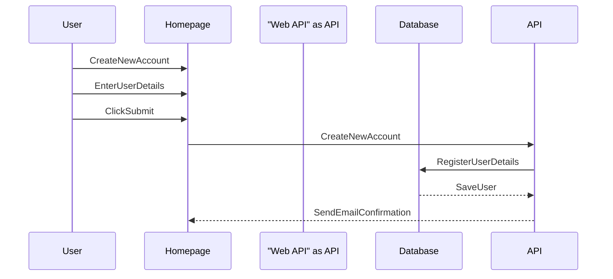
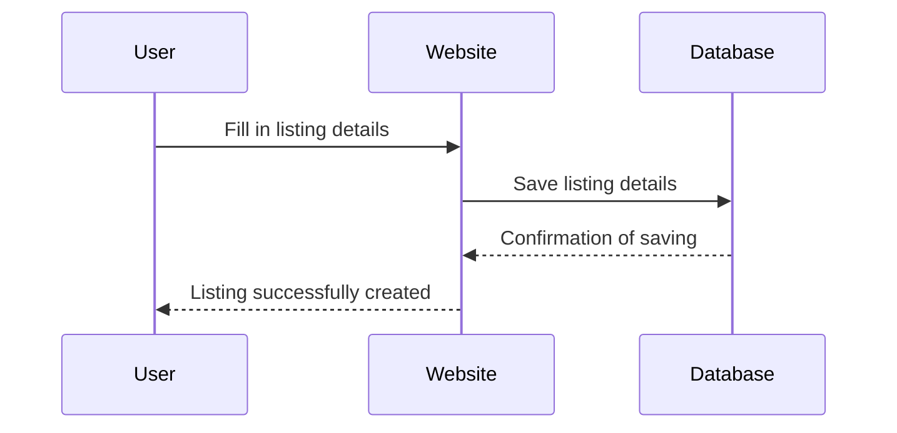
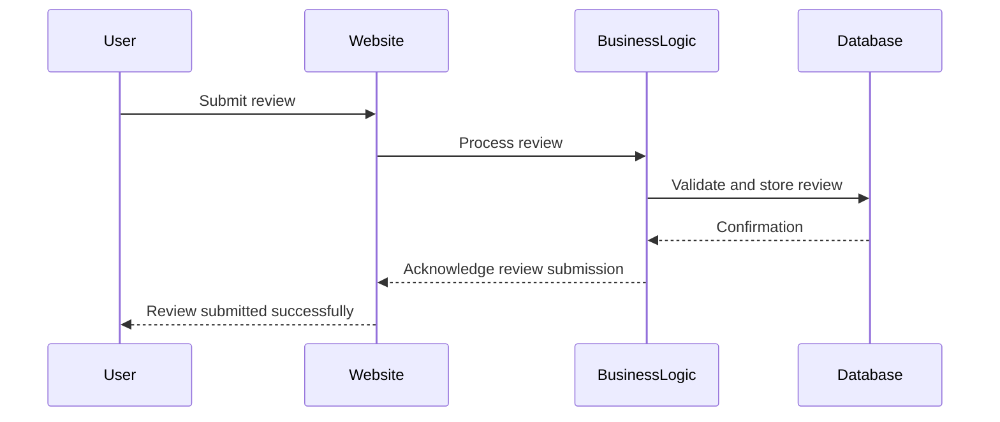

# holbertonschool-hbnb
Technical documentation of mini version of Hbnb

## Introduction
The HBNB project is a website to rent place between users.
The user can set some informations about the place, users, review and amenity.
In this document you will see the diagram use for the project.

## Package Diagram 




## Class Diagram 

This diagram describe the interaction with the différent Logic component.
First the place have some amenity, a amenity cannot exist without place. 
A place is located by a user, this user can make a review about the quality of service. 
AMENITY, USER, PLACE AND REVIEW are the entity use by the website via the BusinessLogicLayer
Relation between place and review. 
1 place can have many review
1 Review is written by one user and one place
1 user can create many review



## Sequence Diagram
In this Sequence we created sequence diagrams that represent the flow of interactions across the different layers of the application for specific API calls. These diagrams show how the presentation layer, business logic and persistence layer communicate with each other to handle user requests. 

## User Registration
User account creation process. The user fills in their information on the homepage, which is transmitted via the web API to be stored in the database with confirmation email sending.

Key Interactions:

- Form validation occurs both client-side and server-side
- Password encryption is handled by the API layer
- Email confirmation ensures user authenticity
- Database transactions ensure data consistency

## Place creation
Simplified listing creation process. The user enters their listing details on the website, which saves them directly to the database and confirms successful creation.


Key Interactions:

- User input validation occurs at the website level
- Business logic handles search algorithm implementation
- Database queries are optimized for performance
- Results are cached for subsequent similar requests

## Review Submission
User review submission flow. The system processes and validates the review through business logic before storing it in the database and confirming submission to the user.



Key Interactions:

- Content moderation prevents inappropriate submissions
- Review validation ensures quality standards
- User authentication is verified before submission
- Confirmation feedback improves user experience

## Fetching a List of Places 
 Place search flow based on user-specified criteria. The user enters their criteria via the website, which interacts with business logic to retrieve and display results from the database.

 ```mermaid
 sequenceDiagram
    participant User
    participant Website
    participant BusinessLogic
    participant Database
    
    User->>Website: Connect to the website
    User->>Website: Enter criteria
    Website->>BusinessLogic: Search for places with criteria
    BusinessLogic->>Database: Save criteria
    Database-->>BusinessLogic: Send criteria
    BusinessLogic-->>Website: Display the places with criteria
```
Key Interactions:

- Form validation ensures complete listing information
- Image upload and processing (if applicable)
- Automatic categorization based on listing attributes
- Immediate confirmation provides user feedback


## Conclusion

System Benefits

This architecture provides several key advantages:

- Scalability: Modular design allows independent scaling of components
- Maintainability: Clear separation of concerns facilitates easier updates
- Security: Multiple validation layers ensure data protection
- Performance: Optimized data flow and caching strategies
- Reliability: Robust error handling and transaction management

This technical document serves as the foundation for successful implementation of our HBnB project, providing clear guidelines and ensuring proper architectural decisions during the lifecycle of the project.


## Authors

- [@Sebastien Salgues](https://github.com/SebSa12000)
- [@Elhadj Reziga](https://www.github.com/hedjouj)


