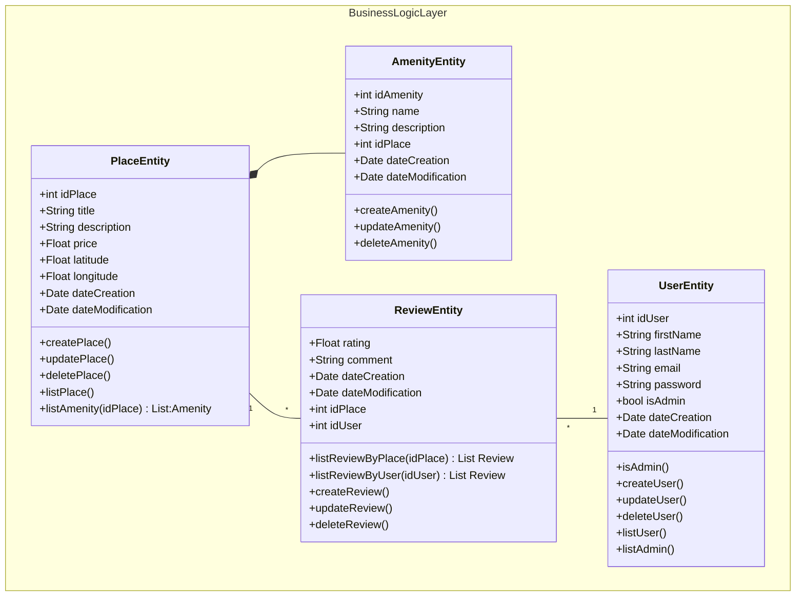

# holbertonschool-hbnb
Technical documentation of mini version of Airbnb

## Class Diagram 

This diagram describe the interaction with the différent Logic component.
First the place have some amenity a amenity cannot exist without place. 
A place is located by a user, this user can make a review about the quality of service. 
AMENITY, USER, PLACE AND REVIEW are the entity use by the website via the BusinessLogicLayer

